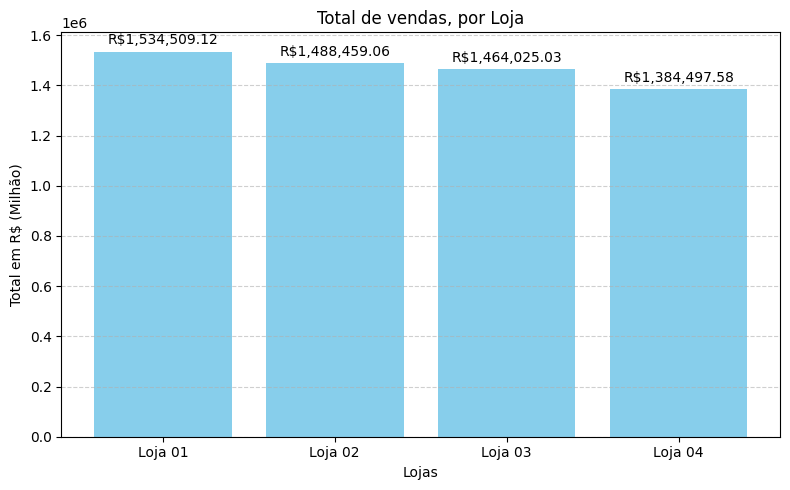

# ChallengeAlluraStore

Projeto desenvolvido em aula, do TECH FOUNDATION - Especialização Data Science, do Modelagem de Dados com Python G8 - ONE: Encare o Challenge Alura Store.

Objetivo: Auxiliar o senhor João em decidir qual das quatro lojas para vender, baseado em dados de desempenho fornecidos, gerando gráficos para melhor resolução.

# Linguagem:

# Programa Utilizado:

# Manipulador de Dados:

# Gráficos Gerados:

